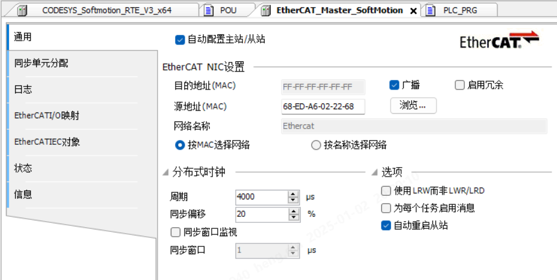

# 第一周
## 1.2 周四
### 贴片厂
* 去了趟贴片厂，看能不能发现是为什么1176有时候起不来
* 目前发现的现象是上电正常的话，后续都能正常，而上电后不正常，下一次掉电前，总是掉的问题会时常出现
### 去工厂更新西门子PLC
* 首先是同一网段，PLC是192.168.0.1，机箱是192.168.0.2，同一网段
* 然后分配设备名
* 然后可以在线，但一直是报错，将机箱上的网线调换一下就好了
### C预处理器
* 看wl的RS485Encoder时，发现C预处理器有些知识点我还不知道
* https://www.runoob.com/cprogramming/c-preprocessors.html
* 发现菜鸟教程写的还挺不错，知识点挺细，挺实用
### 脉冲工具
* ADC采样速录实验
  * AD7190采样速率为2K时，采样出的最大扭矩值与实际现象明显对不上，10rps时最大约0.7NM，100rps时最大约9NM。
  * AD7190采样速率最大可设置为4.8K，但感觉意义不大
* NADC24D003FA
  * 采样率最高96K，Over driving mode时才能达到
  * 普通模式下最
### 去工厂更新codesys
* 从站里面应该也要配一下，点一下浏览里面
* 