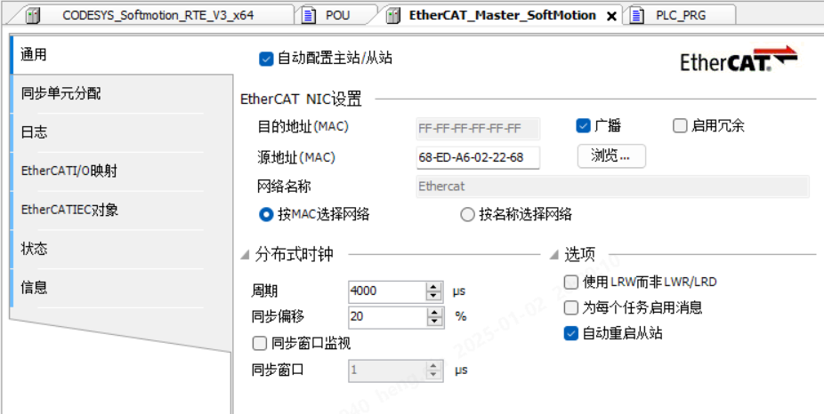

# 第一周
## 1.2 周四
### 贴片厂
* 去了趟贴片厂，看能不能发现是为什么1176有时候起不来
* 目前发现的现象是上电正常的话，后续都能正常，而上电后不正常，下一次掉电前，总是掉的问题会时常出现
### 去工厂更新西门子PLC
* 首先是同一网段，PLC是192.168.0.1，机箱是192.168.0.2，同一网段
* 然后分配设备名
* 然后可以在线，但一直是报错，将机箱上的网线调换一下就好了
### C预处理器
* 看wl的RS485Encoder时，发现C预处理器有些知识点我还不知道
* 字符串常量化运算符（#）,把一个宏的参数转换为字符串常量
* 标记粘贴运算符（##）,合并两个参数
* 还有一些预定义宏
* [demo](../../../note/C/demo.c)
* https://www.runoob.com/cprogramming/c-preprocessors.html
* 发现菜鸟教程写的还挺不错，知识点挺细，挺实用
### 去工厂更新codesys
* 从站里面应该也要配一下，点一下浏览里面，选择Ethercat
* 
### 维护GitHub Daily
* 首先是新建了work文件夹，作为工作文档的维护地点
* 之前可能对git不太理解，现在是push仓库成功了
## 1.6 周一
### 周会
* 压机ST总线：出现UDP掉线30s，30内出现五次。
  * 找阮工，买抓包交换机。
  * 找IT，申请电脑。
* AT+Net90总线版（自实现UDP）跑总线和UDP通讯测试。
  * SPI移植
  * NetX90
* BootLoader
* DCDC测试报告
* DCDC烧录文档
### 脉冲工具实验
* 实验了一下午
### AT+自写UDP
* AT原始代码使用LwIP实现UDP收发，新AT代码使用自写UDO收发

## 1.7 周二
### AT+自写UDP
* 蔡蔡帮助下，找到了几个BUG：一是延时函数的输入超出了范围，二是堆空间不够大。
* 跑起来了，上午十点十分开始测试

### 压机测试
* 发邮件申请电脑
* 问题：UDP220字节之后index在更新，220字节内容不更新
  * 之前测试的UDP确实是没问题，问题出在了SPI端，堆空间不足？
  * 将codesys状态放到220字节当中
  * 
### codesys代码改动
* 修复了UDP接收看门狗
* 
### codesys代码
* Netif_Config()
  * 链路状态发生改变时的回调函数: ethernet_link_status_updated()
  * ethernet_link_status_updated() 中会调用 udp_echoclient_connect()
  * udp_echoclient_connect() 中会创建新的udp对象, 并为udp对象绑定 目标IP 及 udp接收函数 udp_receive_callback()
* ethernetif_input() 和 udp_receive_callback() 间的关系
  * ethernetif_input() 将通过网络接口（如以太网接口）接收到的数据包传递给 LwIP 栈进行进一步的处理
  * 是网络接口层中接收数据的第一步。
  * udp_receive_callback() 是接收到 UDP 数据包时的回调函数
  * 当 LwIP 栈在 IP 层解包并解析数据包时，如果数据包是 UDP 数据包，LwIP 会调用你为 UDP 控制块（upcb）设置的接收回调函数
* Anybus2spi_GetAndSetBusData()
  * 若数据已经被读取，则返回上一帧数据
* sys_check_timeouts()
  * 在 lwip_cyclic_timers[] 中开启了: 
  * TCP 定时器: 用于管理 TCP 协议的各种定时操作，如重传超时、延时确认等。
  * IP 重组定时器: 用于处理 IP 层的数据包重组
  * ARP 定时器: 
  * DHCP 定时器
* runStateRecord_t
  * 150: 总线连接状态
  * 151: 模块连接状态
  * 152: 工作模式超时返回配置模式次数
  * 154: 工作模式下通信成功次数
  * 158: 配置模式下通信成功次数
  * 162: 数据帧错误计数
  * 166: CRC错误计数
  * 170: SPIComRxTotalCnt + CRCErrorCnt
  * 174: WorkingModeCpltCnt + ConfigModeCpltCnt
  * 178: timeTick
  * 182: ModuleOfflineTick