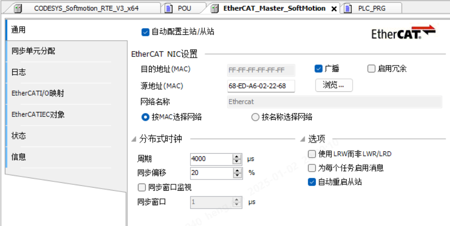

# 第一周
## 1.2 周四
### 贴片厂
* 去了趟贴片厂，看能不能发现是为什么1176有时候起不来
* 目前发现的现象是上电正常的话，后续都能正常，而上电后不正常，下一次掉电前，总是掉的问题会时常出现
### 去工厂更新西门子PLC
* 首先是同一网段，PLC是192.168.0.1，机箱是192.168.0.2，同一网段
* 然后分配设备名
* 然后可以在线，但一直是报错，将机箱上的网线调换一下就好了
### C预处理器
* 看wl的RS485Encoder时，发现C预处理器有些知识点我还不知道
* 字符串常量化运算符（#）,把一个宏的参数转换为字符串常量
* 标记粘贴运算符（##）,合并两个参数
* 还有一些预定义宏
* [demo](../../../note/C/demo.c)
* https://www.runoob.com/cprogramming/c-preprocessors.html
* 发现菜鸟教程写的还挺不错，知识点挺细，挺实用
### 去工厂更新codesys
* 从站里面应该也要配一下，点一下浏览里面，选择Ethercat
* 
### 维护GitHub Daily
* 首先是新建了work文件夹，作为工作文档的维护地点
* 之前可能对git不太理解，现在是push仓库成功了

## 1.3 周五
