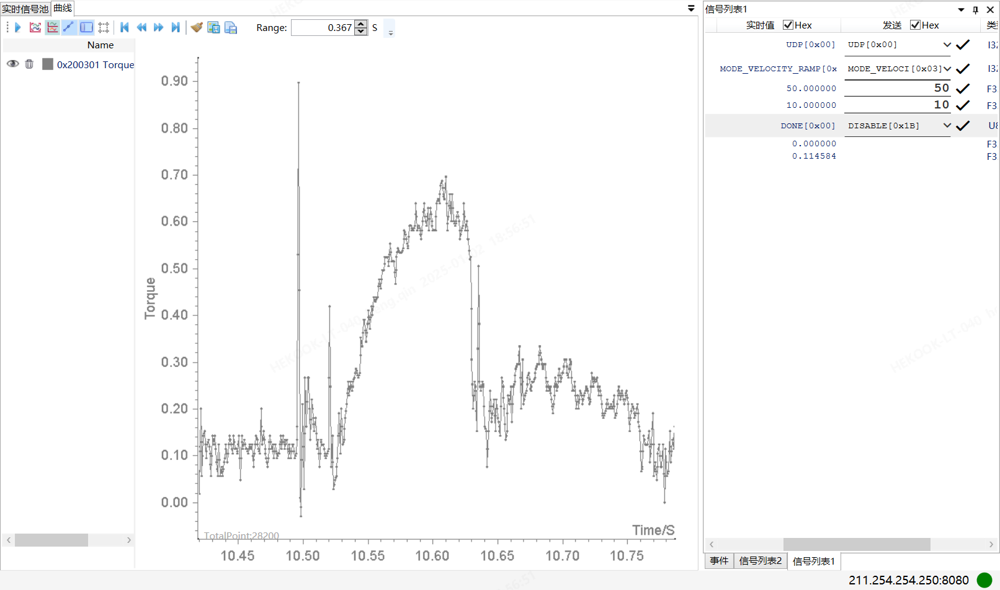

# 简介
* 脉冲工具
# 开发过程
* 单次敲击过程约350us，过低的采样率采不到最大扭矩
* 敲击的目标越是刚性，敲击时间约短，峰值越是难以采集到。故开始时应该是以低转速、非拧紧状态为实验对象。
* 
* 25NM的模拟螺栓
## ADC采样速录实验
* AD7190
  * AD7190采样速率为2K时，采样出的最大扭矩值与实际现象明显对不上，10rps时最大约0.7NM，100rps时最大约9NM。
  * AD7190采样速率最大可设置为4.8K，但感觉意义不大
* NADC24D003FA
  * 采样率最高96K，Over driving mode时才能达到
  * 普通模式下最